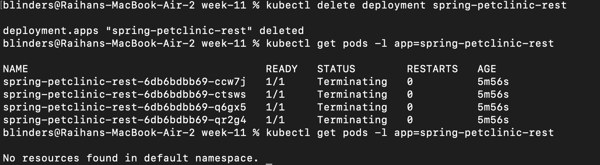
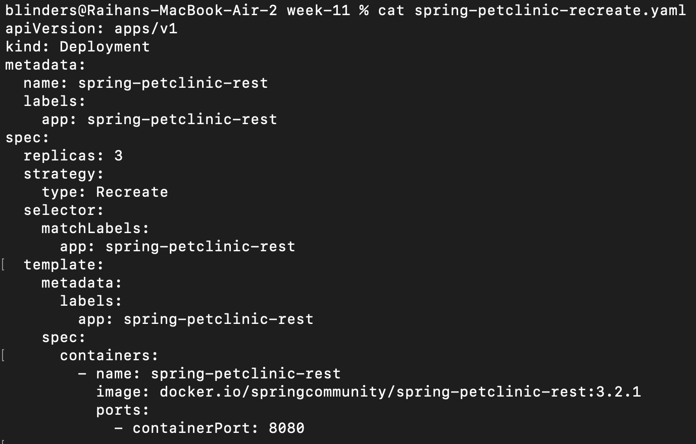
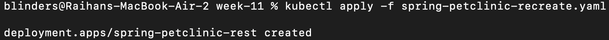
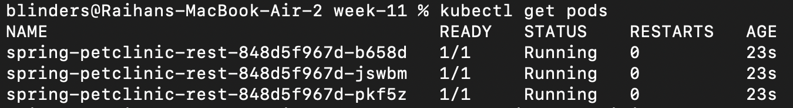
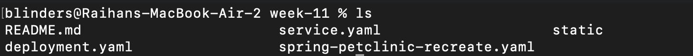

# Reflection on Hello Minikube
1. Compare the application logs before and after you exposed it as a Service. Try to open the app several times while the proxy into the Service is running. What do you see in the logs? Does the number of logs increase each time you open the app?

Yes as you see this is what i got when after close the previous service and open it again

As you see because previously i already open it once on the logs there is 2 GET operation

But after i ran the service again

This is the logs when i open the localhost for the first time.

and this is after i open it for the second time

Based on this it can be shown that the logs mainly show what the processing thing the service or the app do in the moment, on this example it shown that it manage the GET method and everytime i open the web it actually trigger 2 call of some GET functions. 

Also based on this *yes* the number of logs is increase each time i open the website

2. Notice that there are two versions of `kubectl get` invocation during this tutorial section. The first does not have any option, while the latter has `-n` option with value set to `kube-system`. What is the purpose of the `-n` option and why did the output not list the pods/services that you explicitly created?

The -n option in the kubectl command is used to specify the namespace where I want to look for Kubernetes resources. Kubernetes uses namespaces to organize and isolate resources within a cluster. If I don’t provide a namespace, kubectl defaults to the default namespace. When I run `kubectl get pods,services -n kube-system`, it only shows the pods and services in the kube-system namespace, which is reserved for internal components like DNS and other control plane services. Since I created my own pods and services without explicitly specifying a namespace, they were placed in the default namespace. That’s why they didn’t show up when I queried the kube-system namespace.

# Reflection on Rolling Update & Kubernetes Manifest File

1. What is the difference between Rolling Update and Recreate deployment strategy?
In Kubernetes, a Deployment strategy determines how updates to Pods are rolled out when a Deployment's Pod template is modified.

Rolling Update:
- Gradually replaces old Pods with new ones, ensuring some instances of the application remain available during the update.
- It maintains availability by slowly scaling down the old ReplicaSet and scaling up the new one.
- Suitable for zero-downtime updates.

Recreate:
- Terminates all old Pods before creating any new Pods.
- Causes downtime, but ensures a clean start — useful for applications that cannot tolerate overlapping versions (e.g., conflicts with DB schema changes).
- It’s simpler and avoids certain issues related to state conflicts, but at the cost of availability during rollout.

2. Try deploying the Spring Petclinic REST using Recreate deployment strategy and document
your attempt.

First i terminate all current deployment so we have a clean start

Second i wrote some deployment YAML file with a recreate strategy on it, also for a little diffrentitate i create only 3 replica

Third i run those manifest file, using kubectl

Lastly i check if it's running correctly on my machine

And as you see now the deployment on my machine using a recreate strategy is complete.

3. Prepare different manifest files for executing Recreate deployment strategy.

4. What do you think are the benefits of using Kubernetes manifest files? Recall your experience
in deploying the app manually and compare it to your experience when deploying the same app
by applying the manifest files (i.e., invoking `kubectl apply -f` command) to the cluster

Using Kubernetes manifest files made the deployment process much simpler and more consistent compared to deploying the app manually. When I deployed manually, I had to run multiple kubectl commands to create deployments, expose services, and manage configurations, which was repetitive and prone to mistakes. In contrast, with manifest files, everything was declared in one place, and I could deploy or update the entire app using a single `kubectl apply -f command`. This not only saved time but also made the setup more reliable, easier to version control, and reusable across different environments or clusters.

5. (Optional) Do the same tutorial steps, but on a managed Kubernetes cluster (e.g., GCP). You
need to provision a Kubernetes cluster on Google Cloud Platform. Then, re-run the tutorial steps
(Hello Minikube and Rolling Update) on the remote cluster. Document your attempt and highlight
the differences and any issues you encountered.

Deploying the same Spring Petclinic REST application on a managed Kubernetes cluster like Amazon EKS was a significantly different experience compared to using Minikube locally. One of the first differences I noticed was that resource provisioning is abstracted away — I didn’t have to manage the control plane manually, which made the setup feel more production-grade. However, this also added some complexity, especially during the initial setup phase with IAM roles, VPC configuration, and node groups. Tools like eksctl and the AWS CLI helped simplify this, but it still required more cloud knowledge compared to running minikube start.

Another major difference was in terms of scalability and availability. In EKS, deployments are spread across multiple availability zones, which provides fault tolerance out of the box. The same deployment manifest I used in Minikube worked with only minimal changes (mainly around storage class and ingress configurations), which showed the portability and power of Kubernetes manifests. I also appreciated how EKS integrates tightly with AWS services, such as CloudWatch for logging and IAM for pod access control.

That said, debugging on EKS was slightly more involved due to the cloud abstraction — for example, viewing pod logs required proper permissions and setup of kubectl with the right context. Additionally, deploying via EKS incurred real AWS costs, so testing required careful planning.

In my opinion, while Minikube is great for local development and learning, managed services like EKS are essential when deploying real-world applications at scale. They remove the burden of maintaining the control plane, offer better high availability, and allow you to integrate with the broader cloud ecosystem. The tradeoff is the learning curve and more complex networking and security setups. Still, this hands-on comparison made me appreciate both environments and understand when each is appropriate.

