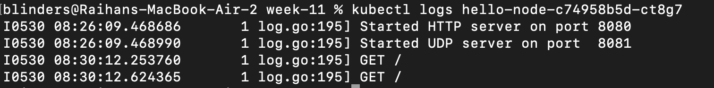
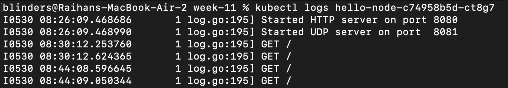
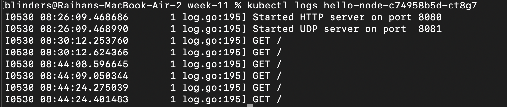

# Reflection on Hello Minikube
1. Compare the application logs before and after you exposed it as a Service. Try to open the app several times while the proxy into the Service is running. What do you see in the logs? Does the number of logs increase each time you open the app?

Yes as you see this is what i got when after close the previous service and open it again

As you see because previously i already open it once on the logs there is 2 GET operation

But after i ran the service again

This is the logs when i open the localhost for the first time.

and this is after i open it for the second time

Based on this it can be shown that the logs mainly show what the processing thing the service or the app do in the moment, on this example it shown that it manage the GET method and everytime i open the web it actually trigger 2 call of some GET functions. 

Also based on this *yes* the number of logs is increase each time i open the website

2. Notice that there are two versions of `kubectl get` invocation during this tutorial section. The first does not have any option, while the latter has `-n` option with value set to `kube-system`. What is the purpose of the `-n` option and why did the output not list the pods/services that you explicitly created?

The -n option in the kubectl command is used to specify the namespace where I want to look for Kubernetes resources. Kubernetes uses namespaces to organize and isolate resources within a cluster. If I don’t provide a namespace, kubectl defaults to the default namespace. When I run `kubectl get pods,services -n kube-system`, it only shows the pods and services in the kube-system namespace, which is reserved for internal components like DNS and other control plane services. Since I created my own pods and services without explicitly specifying a namespace, they were placed in the default namespace. That’s why they didn’t show up when I queried the kube-system namespace.
